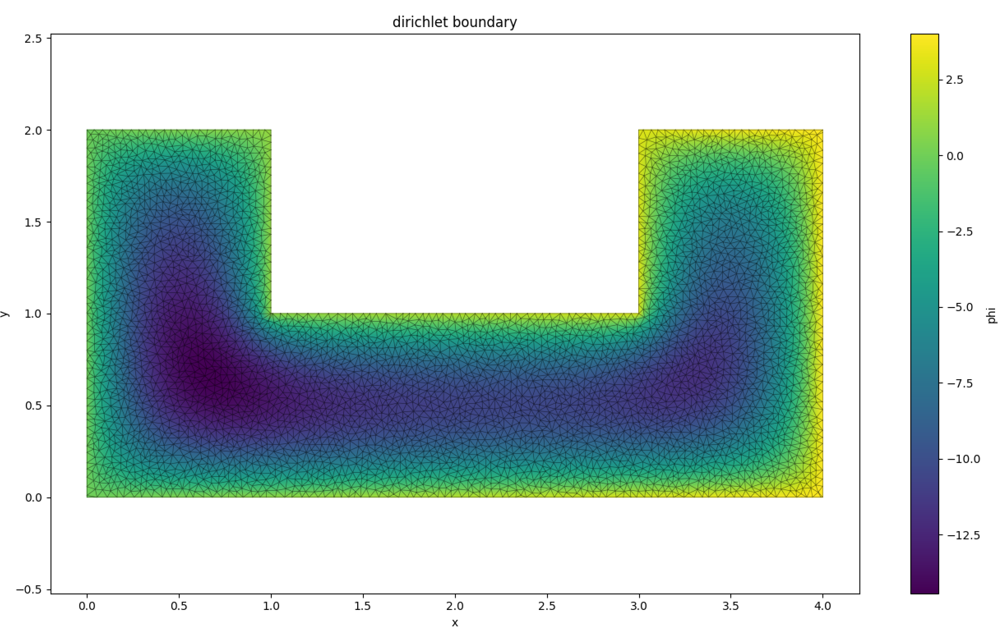
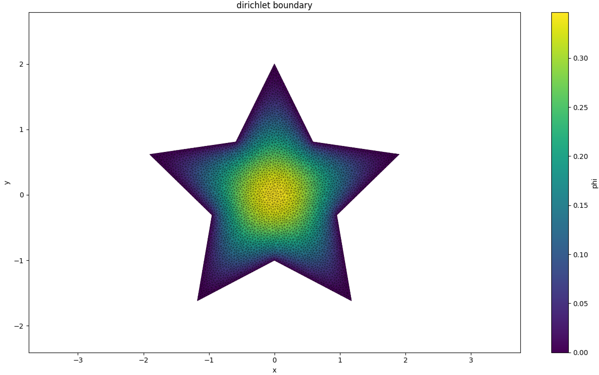
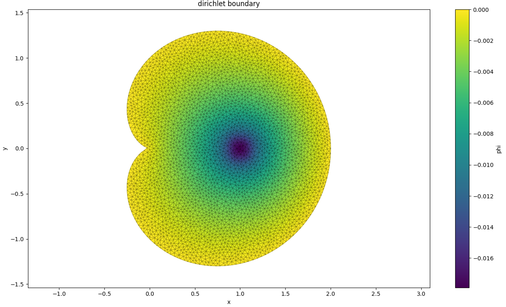
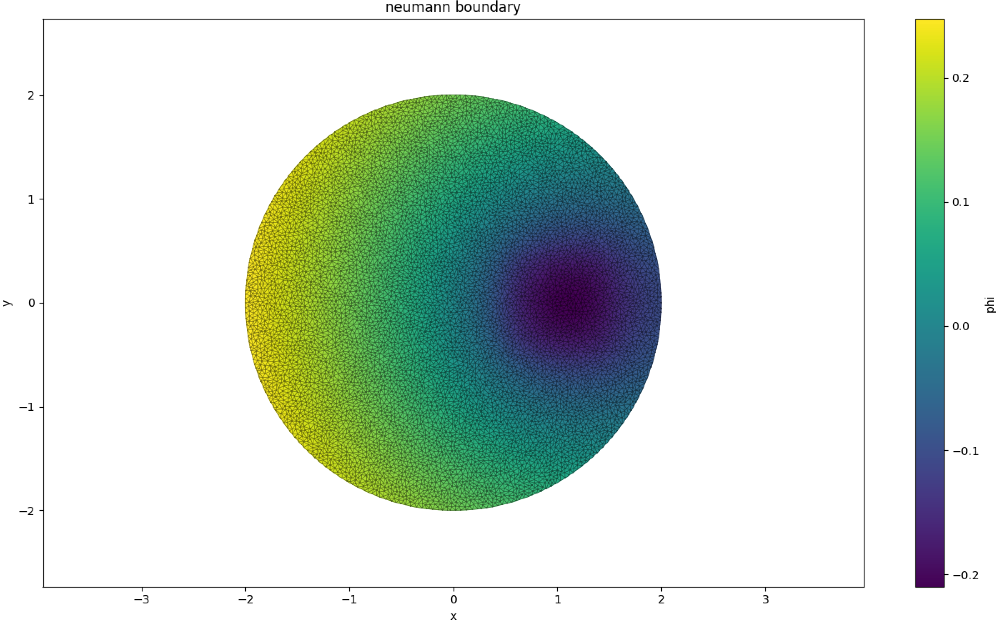

# Finite Element Solver from scratch
## 1.项目简介

使用系统基础库从零开始编写的Poisson方程FEM求解器

即求解方程$\nabla^2 \phi=\rho$

支持2D凹多边形delaunay三角分解

FEM求解器支持自定义纯迪利克雷或诺伊曼边界条件，目前不支持混合边界

具体可以参考demo.cpp和nemo.cpp中调用方法

## 2.项目内容

gen.cpp为三角网格划分，复杂度约$O(n^2)$

LU.cpp为稠密矩阵LU分解，用于求解$K \phi=f$矩阵方程，在$np\ll n$时复杂度约$O(\frac{n^3}{np})$，其中$np$是分块大小

cal.cpp为FEM求解器，组装矩阵，复杂度约$O(n^2)$

demo.cpp演示迪利克雷边界条件求解，nemo.cpp演示诺伊曼边界求解

注意需要保证

$$
\oint \frac{\partial \phi}{\partial \vec{n}} \cdot \mathrm{d}\vec{l}=\iint \rho(\vec{r})\mathrm{d}S
$$

否则解会奇异

## 3.编译方法

linux系统输入make all显示demo.cpp求解结果图像

windows输入
```bat
g++ -O3 -fopenmp LU.cpp gen.cpp cal.cpp demo.cpp -o demo.exe
.\ demo.exe
python plotphi.py 
```
显示迪利克雷求解结果

输入
```bat
g++ -O3 -fopenmp LU.cpp gen.cpp cal.cpp nemo.cpp -o nemo.exe
.\ nemo.exe
python plotphi.py 
```
显示诺伊曼求解结果

## 4.使用方法

```cpp
#include "gen.h"
#include "cal.h"
```

即可使用，输入边界必须顺时针或逆时针，目前自交图形生成网格不稳定，如$r=cos(n\theta)$的玫瑰线

## 5.演示图像

### 1.dirichlet boundary

#### 1.1 边界:

```cpp
double g(point a){
    return a.x;
}
double rho(point a){
    return 100;
}
vector<point> origin_edges={
    {0,0},{4,0},{4,2},{3,2},{3,1},{1,1},{1,2},{0,2}
};
```



#### 1.2 边界:

```cpp
double g(point a){
    return 0;
}
double rho(point a){
    return -1;
}
vector<point> origin_edges = {
    {0.0, 2.0},
    {-0.5878, 0.8090},
    {-1.9022, 0.6180},
    {-0.9511, -0.3090},
    {-1.1756, -1.6180},
    {0.0, -1.0},
    {1.1756, -1.6180},
    {0.9511, -0.3090},
    {1.9022, 0.6180},
    {0.5878, 0.8090}
};
```



#### 1.3 边界:

```cpp
double g(point a){
    return 0;
}
double f(double theta){
    return 1+cos(theta);
}
double rho(point a){
    if(fabs(1-a.x)<0.1&&fabs(a.y)<0.1){
        return 1;
    }
    return 0;
}
```



### 2.neumann boundary

#### 2.1 边界:

```cpp
double g(point a){
    return 1/(4*PI);
}
double f(double theta){
    return 2;
}
double rho(point a){
    if(fabs(a.x-1)<0.5&&fabs(a.y)<0.5){
        return 1;
    }
    return 0;
}
```



## 6.分解效率

在个人16核上电脑测试

| 点数 | 网格生成用时(s) | LU分解用时(s) |
|------|-----------------|---------------|
| 1000 | 0.13            | 0.10          |
| 3000 | 0.98            | 0.67          |
| 9000 | 5.3             | 14.2          |
| 20000| 36.6            | 112.4         |